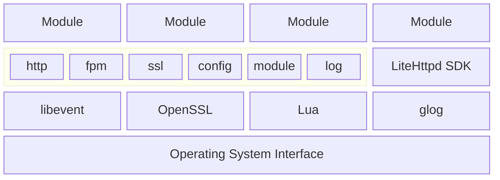

# LiteHttpd - A Lightweight, High-Performance Cross-Platform HTTP(S) Modular Service Framework
[LiteHttpd] is an HTTP service framework completely written in C++. With just the C++ standard library, you can easily [develop modules](#5-Module-Development) to handle HTTP requests.  
- LiteHttpd uses the [Lua] language to write [configuration files](#4-Configuration-File) and supports [Lua 5.4] standard library functions, allowing you to quickly integrate new modules into the existing service system.
- LiteHttpd uses [libevent] to provide support for highly concurrent HTTP services.
- LiteHttpd uses [OpenSSL] to provide SSL protocol support.
- LiteHttpd uses [glog] for logging.
- LiteHttpd comes with an official [file server](#6-File-Server) module and supports [PHP] dynamic websites.

<toc/>

<div STYLE="page-break-after: always;"></div>

## 1 Installation
You can get the latest precompiled version of LiteHttpd from our [Release Page](https://github.com/LiteHttpd/LiteHttpd/releases/latest). Alternatively, you can obtain the latest LiteHttpd by [building it yourself](#2-Building-Yourself) from the latest code commits.  

> [!IMPORTANT]
> Running the MSVC version of LiteHttpd on the Windows platform requires the support of [Visual C++ Redistributable].  

> [!IMPORTANT]
> Running the MinGW version of LiteHttpd on the Windows platform requires the support of the MinGW runtime. You can obtain the MinGW runtime by installing the latest version of [MinGW].  

> [!IMPORTANT]
> Running LiteHttpd on the Linux platform requires the following dependencies (the package names below are for Ubuntu 24.04 LTS; please install the corresponding dependencies for other versions):  
> - libevent-core-2.1-7t64
> - libevent-extra-2.1-7t64
> - libevent-openssl-2.1-7t64
> - libevent-pthreads-2.1-7t64
> - openssl
> - liblua5.4-0
> - libgoogle-glog0v6t64

<div STYLE="page-break-after: always;"></div>

## 2 Building Yourself
### Getting the Source Code
You can get the latest source code from the `main` branch and initialize the [vcpkg] package manager with the following commands. These commands require [Git].  

#### Getting the Source Code on Windows
```
git clone https://github.com/LiteHttpd/LiteHttpd.git
cd LiteHttpd
git submodule update --init --recursive
cd vcpkg
.\bootstrap-vcpkg.bat
cd ..
```

#### Getting the Source Code on Linux
```
git clone https://github.com/LiteHttpd/LiteHttpd.git
cd LiteHttpd
git submodule update --init --recursive
cd vcpkg
./bootstrap-vcpkg.sh
cd ..
```

### Building the Binaries
The build process for LiteHttpd is based on [CMake] and [Ninja], so you need to ensure that they are correctly installed.  

#### Building with MSVC on Windows
Before starting, you need to confirm the MSVC installation directory and correctly set the `%VCINSTALLDIR%` environment variable. You can install [Visual Studio] with the latest version of MSVC from here.  

##### Building the Debug Version with MSVC
```
"%VCINSTALLDIR%\Auxiliary\Build\vcvarsall.bat" amd64
cmake -G "Ninja" -DCMAKE_BUILD_TYPE=Debug -DCMAKE_TOOLCHAIN_FILE:STRING=./vcpkg/scripts/buildsystems/vcpkg.cmake -DVCPKG_TARGET_TRIPLET:STRING=x64-windows -B out/build/x64-Debug-MSVC .
ninja -C out/build/x64-Debug-MSVC -j 8 all
```

##### Building the Release Version with MSVC
```
"%VCINSTALLDIR%\Auxiliary\Build\vcvarsall.bat" amd64
cmake -G "Ninja" -DCMAKE_BUILD_TYPE=Release -DCMAKE_TOOLCHAIN_FILE:STRING=./vcpkg/scripts/buildsystems/vcpkg.cmake -DVCPKG_TARGET_TRIPLET:STRING=x64-windows -B out/build/x64-Release-MSVC .
ninja -C out/build/x64-Release-MSVC -j 8 all
```

#### Building with MinGW on Windows
Before starting, you need to install the latest version of [MinGW] and correctly set the environment variables. Additionally, this version still requires MSVC support. You can install [Visual Studio] with the latest version of MSVC from here.  

##### Building the Debug Version with MinGW
```
set CC=gcc
set CXX=c++
cmake -G "Ninja" -DCMAKE_BUILD_TYPE=Debug -DCMAKE_TOOLCHAIN_FILE:STRING=./vcpkg/scripts/buildsystems/vcpkg.cmake -DVCPKG_TARGET_TRIPLET:STRING=x64-mingw-dynamic -B out/build/x64-Debug-MinGW .
ninja -C out/build/x64-Debug-MinGW -j 8 all
```

##### Building the Release Version with MinGW
```
set CC=gcc
set CXX=c++
cmake -G "Ninja" -DCMAKE_BUILD_TYPE=Release -DCMAKE_TOOLCHAIN_FILE:STRING=./vcpkg/scripts/buildsystems/vcpkg.cmake -DVCPKG_TARGET_TRIPLET:STRING=x64-mingw-dynamic -B out/build/x64-Release-MinGW .
ninja -C out/build/x64-Release-MinGW -j 8 all
```

#### Building with GCC on Linux
Before starting, you need to install the latest versions of the GCC and G++ compilers. On Ubuntu, you can get the compilers by installing the `build-essential` package.  

##### Building the Debug Version with GCC
```
export CC=gcc
export CXX=c++
cmake -G "Ninja" -DCMAKE_BUILD_TYPE=Debug -DCMAKE_TOOLCHAIN_FILE:STRING=./vcpkg/scripts/buildsystems/vcpkg.cmake -DVCPKG_TARGET_TRIPLET:STRING=x64-linux -B ./out/build/x64-Debug-GCC .
ninja -C ./out/build/x64-Debug-GCC -j 8 all
```

##### Building the Release Version with GCC
```
export CC=gcc
export CXX=c++
cmake -G "Ninja" -DCMAKE_BUILD_TYPE=Release -DCMAKE_TOOLCHAIN_FILE:STRING=./vcpkg/scripts/buildsystems/vcpkg.cmake -DVCPKG_TARGET_TRIPLET:STRING=x64-linux -B ./out/build/x64-Release-GCC .
ninja -C ./out/build/x64-Release-GCC -j 8 all
```

<div STYLE="page-break-after: always;"></div>

## 3 Startup Parameters
Run LiteHttpd with the following command:  

```
LiteHttpd <configuration_file_path>
```

If the configuration file path is not specified, LiteHttpd will automatically use `config.lua` in the working directory as the default configuration file.  

<div STYLE="page-break-after: always;"></div>

## 4 Configuration File
The configuration file uses the [Lua] language, syntax version [Lua 5.4], and supports the Lua standard library.

### Function Documentation
#### set_port(port)
> **Parameters:**  
> - port: **Integer**, the port number which the current server process will listen to. The default port is 80.
>
> **Returns:** None.  

#### set_https(use_https)
> **Parameters:**  
> - use_https: **Boolean**, whether the current server uses HTTPS. The default is not to use HTTPS.
>
> **Returns:** None.  

#### set_default_page(path)
> **Parameters:**  
> - path: **String**, the path to the server's welcome page. The default is `default.html` in the LiteHttpd directory.
>
> **Returns:** None.  

#### add_module(host, path)
> **Parameters:**  
> - host: **String**, the host name in the HTTP request.
> - path: **String**, the path to the module handling the corresponding request. No need to add file extension; LiteHttpd will append `.dll`, `.so`, or `.dylib` based on the platform.
>
> **Returns:** None.  

#### remove_module(host)
> **Parameters:**  
> - host: **String**, the host name in the HTTP request.
>
> **Returns:** None.  

#### add_cer(host, key_path, cer_path)
> **Parameters:**  
> - host: **String**, the host name in the SNI field during SSL handshake.
> - key_path: **String**, the path to the SSL private key. The SSL private key should be in PEM format.
> - cer_path: **String**, the path to the SSL certificate. The SSL certificate should be a PEM format X.509 certificate chain, with the CA root certificate and intermediate certificates concatenated in order after the site certificate to form the certificate chain.
>
> **Returns:** None.  

#### remove_cer(host)
> **Parameters:**  
> - host: **String**, the host name in the SNI field during SSL handshake.
>
> **Returns:** None.  

### Example Configuration File
Below is an example of the default configuration file:  

```lua
set_port(443) -- Server listens on port 443
set_https(true) -- Use HTTPS service

-- Set SSL private key and certificate for the localhost domain
add_cer("localhost", "./localhost.key", "./localhost.cer")
-- Specify using the LiteHttpd.FileServer module to handle HTTP requests for localhost
add_module("localhost", "./LiteHttpd.FileServer")
```

### Example of Default Welcome Page


<div STYLE="page-break-after: always;"></div>

## 5 Module Development
LiteHttpd allows for convenient development of modules to handle different HTTP requests and provides the [LiteHttpd SDK] to support module development.  

### Importing the LiteHttpd SDK
You can add the LiteHttpd SDK as a submodule to your project using [Git]:  

```
git submodule add https://github.com/LiteHttpd/LiteHttpd.Dev.git
```

When using [CMake], you can link the LiteHttpd SDK with the following commands:  

```cmake
# Import the SDK
if (NOT TARGET LiteHttpdDev::core)
    add_subdirectory(LiteHttpd.Dev)
endif()

# Link the SDK
target_link_libraries(your_target PRIVATE LiteHttpdDev::core)
```

### Including SDK Header Files in Your Code
Include the `LiteHttpdDev.h` header file in the files where you need to use the SDK:  

```cpp
#include <LiteHttpdDev.h>
```

### Writing a Module Class
Create your own module class and inherit it from the `ModuleBase` class. Override the `processRequest` method to implement your own request handling codes:  

```cpp
class YourModule : public ModuleBase {

    // ...

public:
	void processRequest(const RequestParams& rp) override;

    // ...

};

void YourModule::processRequest(const RequestParams& rp) {
    // Handling Request
}
```
 
### Registering the Module Class
Use the `LITEHTTPD_MODULE` macro to register your module class as the exported module class:  

```cpp
LITEHTTPD_MODULE(YourModule)
```

### Request Parameters Reference
The `processRequest` method takes a parameter of type `RequestParams`, which has the following properties and public methods:  
- **protocol: ProtocolType** The protocol type of the request
- **addr: string** The host field of the request
- **port: uint16_t** The port number of the request
- **path: string** The path field of the request
- **query: string** The query field of the request
- **params: ParamList** The parsed parameters from the request query
- **method: MethodType** The HTTP method of the request
- **headers: ParamList** The list of request headers
- **data: vector<char>** The content of the request data
- **peerAddr: string** The IP address of the client
- **peerPort: uint16_t** The port number of the client

- **int getResponseCode()** Returns the HTTP status code if the request has been responded, otherwise returns 0
- **void reply(int code, const std::vector<char>& data)** Sends the response code and response data. This method must be called once per request, unless using chunked responses
- **void replyStart(int code)** Starts sending a chunked response. Each request must have either a regular response or a chunked response
- **void replyData(const std::vector<char>& data)** Sends chunked response data
- **void replyEnd()** Ends the chunked response
- **void addHeader(const std::string& key, const std::string& value)** Adds a header field to the response for the current request
- **void log(LogLevel level, const std::string& data)** Writes a log message
- **const FPMResult callFPM(const std::string& addr, uint16_t port, const std::vector<char>& data, const ParamList& params)** Calls PHP and receives the result

<div STYLE="page-break-after: always;"></div>

## 6 File Server
[LiteHttpd.FileServer] is the official implementation of the LiteHttpd file server module.  
This module communicates with PHP-FPM via FastCGI to execute PHP script files. This feature requires installing [PHP] and starting the FPM or CGI-related services.  
It can also communicate with other services via FastCGI.  

### File Server Configuration File
LiteHttpd.FileServer uses JSON as the configuration file format, located in the module directory as `LiteHttpd.FileServer.json`.  
Below is an example of the default configuration file:  

```json
{
  "survival": 60,
  "root": "C:/wwwroot/$hostname$",
  "page404": "404.html",
  "page403": "403.html",
  "defaultPage": "index.html",
  "fpm": {
    "surfix": ".php",
    "address": "127.0.0.1",
    "port": 9000,
    "fcgi_children": 2,
    "fcgi_max_requests": 1000
  }
}
```

- **survival:** The lifespan of the file cache in seconds. The default value is `60`.
- **root:** The location of the website's root directory. Supports matching and replacing `$hostname$` and `$port$` with actual parameters. The default value is `"./$hostname$"`.
- **page404:** The path to the 404 error page. Supports matching and replacing `$hostname$`, `$port$`, and `$root$` with actual parameters. The default value is `"404.html"`.
- **page403:** The path to the 403 error page. Supports the same parameter matching as the 404 error page. The default value is `"403.html"`.
- **defaultPage:** The default page name for the website. When the request path is a directory, the default page under the directory will be returned. The default value is `"index.html"`.
- **fpm.surfix:** The file types to be processed via FastCGI. The default value is `".php"`.
- **fpm.address:** The FastCGI service address. The default value is `"127.0.0.1"`.
- **fpm.port:** The FastCGI service port. The default value is `9000`.
- **fpm.fcgi_children:** The `PHP_FCGI_CHILDREN` parameter passed to PHP-FPM. The default value is `2`.
- **fpm.fcgi_max_requests:** The `PHP_FCGI_MAX_REQUESTS` parameter passed to PHP-FPM. The default value is `1000`.

### Default 403 Page Example


### Default 404 Page Example


### PHP Page Example


<div STYLE="page-break-after: always;"></div>

## 7 Log System
LiteHttpd uses [glog] for application logging and categorizes logs into four levels: `INFO` `WARNING` `ERROR` `FATAL`. These logs are stored in the `logs` directory within the LiteHttpd installation directory. When LiteHttpd is built with the `Debug` option, `DEBUG` level logs are also recorded along with `INFO` level logs, and a `(Debug)` label is added to the beginning of the debug messages.  

### Log Naming
A standard LiteHttpd file name is as follows:  

```
LiteHttpd.HOSTNAME.USERNAME.log.LEVEL.yyyymmdd-hhmmss.uuuuuu
```

- **HOSTNAME:** The name of the current host
- **USERNAME:** The name of the current user
- **LEVEL:** Log level
- **yyyymmdd:** Process start date in year-month-day format
- **hhmmss:** Process start time in hour-minute-second format
- **uuuuuu:** Process start time in microsecond format

### Log Format
A standard LiteHttpd log format is as follows:  

```
[IWEF yyyymmdd hh:mm:ss.uuuuuu threadid] msg
```

- **IWEF:** Log level, represented by a single letter
- **yyyymmdd:** Date in year-month-day format
- **hh:mm:ss.uuuuuu:** Time, precise to microseconds
- **threadid:** ID of the log thread
- **msg:** Log message

<div STYLE="page-break-after: always;"></div>

## 8 Architecture Design
The architecture of LiteHttpd is divided into four layers:



1. Operating System Interface Layer: This is the foundational layer.  
2. Dependency Layer: This layer provides support for the HTTP, SSL, Lua, and logging subsystems.  
3. Service Layer: Positioned above the dependency layer, the service layer consists of the LiteHttpd program and the SDK. LiteHttpd itself is divided into six modules: http, fpm, ssl, config, module, and log.  
4. Module Layer: The topmost layer comprises one or more request handling modules. These modules interact with the core LiteHttpd via the SDK to handle various HTTP requests.

<div STYLE="page-break-after: always;"></div>

## 9 CI/CD Pipeline
LiteHttpd uses [GitHub Actions] to set up its CI/CD pipeline, which is divided into two parts: [Build](https://github.com/LiteHttpd/LiteHttpd/actions/workflows/build-artifacts.yml) and [Release](https://github.com/LiteHttpd/LiteHttpd/actions/workflows/upload-release.yml).  

### Build Pipeline
The build pipeline is triggered when a new push to the [main branch](https://github.com/LiteHttpd/LiteHttpd/tree/main) or a new pull request (PR) is made to the remote repository. The build pipeline includes the following steps:  

1. Prebuild vcpkg packages and generate package caches on both Windows and Linux platforms.
2. Build the LiteHttpd program and its official modules on both Windows and Linux platforms.
3. Clean up temporary files generated during the build process.
4. Sign the LiteHttpd program and official modules with [Sigstore].
5. Package the build results and store them as artifacts.


### Release Pipeline
The release pipeline is triggered when a new tag is created in the repository. The release pipeline includes the following steps:  

1. Execute the build pipeline.
2. Create a new release.
3. Download the build artifacts from the build pipeline.
4. Repackage the build artifacts to formats suitable for the respective platforms.
5. Upload the packages to the release.


<div STYLE="page-break-after: always;"></div>

# 10 Related Links
- [Lua]: The Programming Language Lua.
- [MinGW]: MinGW-W64 compiler binaries.
- [vcpkg]: Open source C/C++ dependency manager from Microsoft
- [Git]: A free and open source distributed version control system.
- [CMake]: A Powerful Software Build System.
- [Ninja]: A small build system with a focus on speed.
- [Visual Studio]: IDE and Code Editor for Software Developers and Teams. 
- [libevent]: The libevent API provides a mechanism to execute a callback function when a specific event occurs on a file descriptor or after a timeout has been reached.
- [OpenSSL]: Cryptography and SSL/TLS Toolkit.
- [glog]: Google Logging Library.
- [PHP]: A popular general-purpose scripting language that is especially suited to web development.
- [LiteHttpd SDK]: Module SDK for LiteHttpd.
- [LiteHttpd.FileServer]: A simple LiteHttpd file server module.
- [Sigstore]: sign. verify. protect.

[LiteHttpd]: https://github.com/LiteHttpd/LiteHttpd
[Lua]: https://www.lua.org/
[Lua 5.4]: https://www.lua.org/manual/5.4/
[MinGW]: https://github.com/niXman/mingw-builds-binaries
[Visual C++ Redistributable]: https://aka.ms/vs/17/release/VC_redist.x64.exe
[vcpkg]: https://vcpkg.io/
[Git]: https://git-scm.com/
[CMake]: https://cmake.org/
[Ninja]: https://ninja-build.org/
[Visual Studio]: https://visualstudio.microsoft.com/
[libevent]: https://libevent.org/
[OpenSSL]: https://www.openssl.org/
[glog]: https://google.github.io/glog
[PHP]: https://www.php.net/
[LiteHttpd SDK]: https://github.com/LiteHttpd/LiteHttpd.Dev
[LiteHttpd.FileServer]: https://github.com/LiteHttpd/LiteHttpd.FileServer
[GitHub Actions]: https://github.com/LiteHttpd/LiteHttpd/actions
[Sigstore]: https://www.sigstore.dev/
