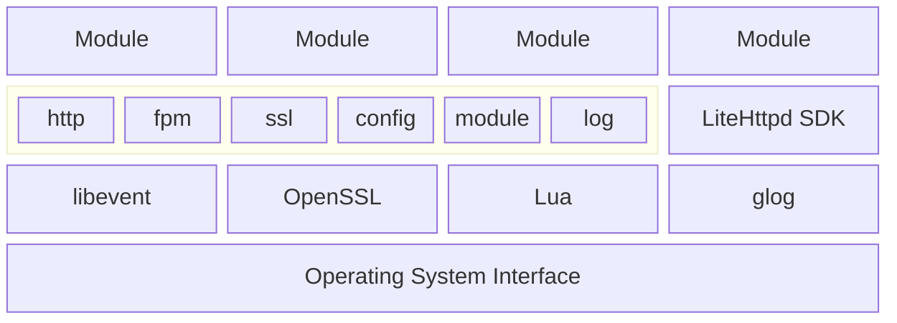

# LiteHttpd - 一个轻量级、高性能的跨平台 http(s) 模块化服务框架

[LiteHttpd][LiteHttpd] 是一个完全由 C++ 语言编写的 http 服务框架。只需使用 C++ 标准库，即可轻松的 [开发模块](#5-模块开发) 以处理 http 请求。

- LiteHttpd 使用 [Lua][Lua] 语言编写 [配置文件](#4-配置文件)，支持 [Lua 5.4][Lua 5.4] 标准库函数，可以快速地将新模块加入现有服务系统。
- LiteHttpd 使用 [libevent][libevent] 提供高并发 http 服务支持。
- LiteHttpd 使用 [OpenSSL][OpenSSL] 提供 SSL 通信支持。
- LiteHttpd 使用 [glog][glog] 记录日志。
- LiteHttpd 带有一个官方的 [文件服务器](#6-文件服务器) 模块，并提供对于 [PHP][PHP] 动态网站的支持。

<toc/>

<div STYLE="page-break-after: always;"></div>

## 1 安装

在我们的 [Release页面](https://github.com/LiteHttpd/LiteHttpd/releases/latest) 可以获得最新发布版本的 LiteHttpd 预编译程序。或者可以通过 [自行构建](#2-自行构建) 从最新的代码提交获得最新的 LiteHttpd。

> [!IMPORTANT]
> 在 Windows 平台上运行 MSVC 版本的 LiteHttpd 需要 [Visual C++ 可再发行组件][Visual C++ 可再发行组件] 的支持。

> [!IMPORTANT]
> 在 Windows 平台上运行 MinGW 版本的 LiteHttpd 需要 MinGW 运行时的支持，你可以通过安装最新版的 [MinGW][MinGW] 获得 MinGW 运行时。

> [!IMPORTANT]
> 在 Linux 平台上运行 LiteHttpd 需要以下依赖库（以下为 Ubuntu 24.04 LTS 版本包名，其他版本请自行安装对应依赖）：
>
> - libevent-core-2.1-7t64
> - libevent-extra-2.1-7t64
> - libevent-openssl-2.1-7t64
> - libevent-pthreads-2.1-7t64
> - openssl
> - liblua5.4-0
> - libgoogle-glog0v6t64

<div STYLE="page-break-after: always;"></div>

## 2 自行构建

### 获取源码

通过如下命令，你可以获得 `main` 分支上的最新源码并初始化 [vcpkg][vcpkg] 包管理器。这些命令需要 [Git][Git] 的支持。

#### 在 Windows 上获取源码

```
git clone https://github.com/LiteHttpd/LiteHttpd.git
cd LiteHttpd
git submodule update --init --recursive
cd vcpkg
.\bootstrap-vcpkg.bat
cd ..
```

#### 在 Linux 上获取源码

```
git clone https://github.com/LiteHttpd/LiteHttpd.git
cd LiteHttpd
git submodule update --init --recursive
cd vcpkg
./bootstrap-vcpkg.sh
cd ..
```

### 构建可执行程序

LiteHttpd 的构建是基于 [CMake][CMake] 和 [Ninja][Ninja] 的，你需要确认它们已得到正确安装。

#### 在 Windows 上使用 MSVC 构建

在开始前，需要确认 MSVC 的安装目录并正确设置环境变量 `%VCINSTALLDIR%`。你可以从这里安装带有最新版本 MSVC 的 [Visual Studio][Visual Studio]。

##### 使用 MSVC 构建 Debug 版本

```
"%VCINSTALLDIR%\Auxiliary\Build\vcvarsall.bat" amd64
cmake -G "Ninja" -DCMAKE_BUILD_TYPE=Debug -DCMAKE_TOOLCHAIN_FILE:STRING=./vcpkg/scripts/buildsystems/vcpkg.cmake -DVCPKG_TARGET_TRIPLET:STRING=x64-windows -B out/build/x64-Debug-MSVC .
ninja -C out/build/x64-Debug-MSVC -j 8 all
```

##### 使用 MSVC 构建 Release 版本

```
"%VCINSTALLDIR%\Auxiliary\Build\vcvarsall.bat" amd64
cmake -G "Ninja" -DCMAKE_BUILD_TYPE=Release -DCMAKE_TOOLCHAIN_FILE:STRING=./vcpkg/scripts/buildsystems/vcpkg.cmake -DVCPKG_TARGET_TRIPLET:STRING=x64-windows -B out/build/x64-Release-MSVC .
ninja -C out/build/x64-Release-MSVC -j 8 all
```

#### 在 Windows 上使用 MinGW 构建

在开始前，需要安装最新版本的 [MinGW][MinGW] 并正确设置环境变量。另外此版本构建仍需要 MSVC 支持，你可以从这里安装带有最新版本 MSVC 的 [Visual Studio][Visual Studio]。

##### 使用 MinGW 构建 Debug 版本

```
set CC=gcc
set CXX=c++
cmake -G "Ninja" -DCMAKE_BUILD_TYPE=Debug -DCMAKE_TOOLCHAIN_FILE:STRING=./vcpkg/scripts/buildsystems/vcpkg.cmake -DVCPKG_TARGET_TRIPLET:STRING=x64-mingw-dynamic -B out/build/x64-Debug-MinGW .
ninja -C out/build/x64-Debug-MinGW -j 8 all
```

##### 使用 MinGW 构建 Release 版本

```
set CC=gcc
set CXX=c++
cmake -G "Ninja" -DCMAKE_BUILD_TYPE=Release -DCMAKE_TOOLCHAIN_FILE:STRING=./vcpkg/scripts/buildsystems/vcpkg.cmake -DVCPKG_TARGET_TRIPLET:STRING=x64-mingw-dynamic -B out/build/x64-Release-MinGW .
ninja -C out/build/x64-Release-MinGW -j 8 all
```

#### 在 Linux 上使用 GCC 构建

在开始前，需要安装最新版本的 GCC 与 G++ 编译器。在 Ubuntu 上，你可以通过安装 `build-essential` 包以获得相应编译器支持。

##### 使用 GCC 构建 Debug 版本

```
export CC=gcc
export CXX=c++
cmake -G "Ninja" -DCMAKE_BUILD_TYPE=Debug -DCMAKE_TOOLCHAIN_FILE:STRING=./vcpkg/scripts/buildsystems/vcpkg.cmake -DVCPKG_TARGET_TRIPLET:STRING=x64-linux -B ./out/build/x64-Debug-GCC .
ninja -C ./out/build/x64-Debug-GCC -j 8 all
```

##### 使用 GCC 构建 Release 版本

```
export CC=gcc
export CXX=c++
cmake -G "Ninja" -DCMAKE_BUILD_TYPE=Release -DCMAKE_TOOLCHAIN_FILE:STRING=./vcpkg/scripts/buildsystems/vcpkg.cmake -DVCPKG_TARGET_TRIPLET:STRING=x64-linux -B ./out/build/x64-Release-GCC .
ninja -C ./out/build/x64-Release-GCC -j 8 all
```

<div STYLE="page-break-after: always;"></div>

## 3 启动参数

使用如下的命令运行 LiteHttpd：

```
LiteHttpd <配置文件路径>
```

当未指定配置文件路径时，LiteHttpd 将自动使用工作目录下 `config.lua` 作为默认配置文件。

<div STYLE="page-break-after: always;"></div>

## 4 配置文件

配置文件使用 [Lua][Lua] 语言，语法版本为 [Lua 5.4][Lua 5.4]，支持 Lua 标准库。

### 函数文档

#### set_port(port)

> **参数：**
>
> - port: **整数**，当前服务器进程要监听的端口号。默认状态下使用 80 端口。
>
> **返回值：** 无。

#### set_https(use_https)

> **参数：**
>
> - use_https: **布尔**，当前服务器是否使用 https。默认状态下不使用 https。
>
> **返回值：** 无。

#### set_default_page(path)

> **参数：**
>
> - path: **字符串**，服务器欢迎页的路径。默认状态下使用 LiteHttpd 目录下 `default.html`。
>
> **返回值：** 无。

#### add_module(host, path)

> **参数：**
>
> - host: **字符串**，http 请求中的站点名。
> - path: **字符串**，处理相应请求的模块路径。不需要添加扩展名，LiteHttpd 会根据平台在路径后添加 `.dll` `.so` `.dylib`。
>
> **返回值：** 无。

#### remove_module(host)

> **参数：**
>
> - host: **字符串**，http 请求中的站点名。
>
> **返回值：** 无。

#### add_cer(host, key_path, cer_path)

> **参数：**
>
> - host: **字符串**，SSL 握手时 SNI 字段中的站点名。
> - key_path: **字符串**，SSL 私钥路径。SSL 私钥应为 PEM 格式。
> - cer_path: **字符串**，SSL 证书路径。SSL 证书应为 PEM 格式的 X.509 证书链，可将 CA 根证书与中间证书按顺序拼接在站点证书后得到证书链。
>
> **返回值：** 无。

#### remove_cer(host)

> **参数：**
>
> - host: **字符串**，SSL 握手时 SNI 字段中的站点名。
>
> **返回值：** 无。

### 配置文件示例

以下是默认配置文件的示例：

```lua
set_port(443) -- 服务器监听 443 端口
set_https(true) -- 使用 https 服务

-- 为 localhost 域名设置 SSL 私钥与证书
add_cer("localhost", "./localhost.key", "./localhost.cer")
-- 指定使用 LiteHttpd.FileServer 模块处理 localhost 的 http 请求
add_module("localhost", "./LiteHttpd.FileServer")
```

### 默认欢迎页面示例


<div STYLE="page-break-after: always;"></div>

## 5 模块开发

LiteHttpd 可以便捷地开发模块以处理不同的 http 请求，并提供了 [LiteHttpd SDK][LiteHttpd SDK] 以支持模块开发。

### 引用 LiteHttpd SDK

你可以使用 [Git][Git] 将 LiteHttpd SDK 作为子模块添加到你的项目中：

```
git submodule add https://github.com/LiteHttpd/LiteHttpd.Dev.git
```

当你使用 [CMake][CMake] 时，你可以使用以下命令链接 LiteHttpd SDK：

```cmake
# 引用 SDK
if (NOT TARGET LiteHttpdDev::core)
	add_subdirectory (LiteHttpd.Dev)
endif ()

# 链接 SDK
target_link_libraries (your_target PRIVATE LiteHttpdDev::core)
```

### 在代码中包含 SDK 头文件

在你的代码需要使用 SDK 的文件中包含 `LiteHttpdDev.h` 头文件：

```cpp
#include <LiteHttpdDev.h>
```

### 编写模块类

创建你自己的模块类并使其派生自 `ModuleBase` 类，重写 `processRequest` 方法实现自己的请求处理逻辑：

```cpp
class YourModule : public ModuleBase {

    // ...

public:
	void processRequest(const RequestParams& rp) override;

    // ...

};

void YourModule::processRequest(const RequestParams& rp) {
    // 处理请求
}
```

### 注册模块类

使用宏 `LITEHTTPD_MODULE` 将你自己的模块类注册为该模块导出的模块类：

```cpp
LITEHTTPD_MODULE(YourModule)
```

### 请求参数参考

`processRequest` 方法的传入参数类型为 `RequestParams`，其中具有以下属性及公共方法：

- **protocol:ProtocolType** 请求的协议类型
- **addr:string** 请求的 host 字段
- **port:uint16_t** 请求的端口号
- **path:string** 请求的路径
- **query:string** 请求的 query 字段
- **params:ParamList** 解析后的请求 query 中的参数
- **method:MethodType** 请求的 http 方法
- **headers:ParamList** 请求头数据列表
- **data:vector\<char\>** 请求的数据内容
- **peerAddr:string** 客户端的 ip 地址
- **peerPort:uint16_t** 客户端的端口号
- **int getResponseCode()** 当请求已响应时，获取相应的 http 状态码，否则返回 0
- **void reply(int code, const std::vector`<char>`& data)** 发送响应码及响应数据进行响应。对于每个请求，除非分片响应，必须调用一次此方法
- **void replyStart(int code)** 开始发送分片响应。对于每个请求，都要进行一次常规响应或分片响应
- **void replyData(const std::vector`<char>`& data)** 发送分片响应数据
- **void replyEnd()** 结束分片响应
- **void addHeader(const std::string& key, const std::string& value)** 为本次请求的响应添加响应头字段
- **void log(LogLevel level, const std::string& data)** 写入单条日志
- **const FPMResult callFPM(const std::string& addr, uint16_t port, const std::vector`<char>`& data, const ParamList& params)** 调用 PHP 并接收调用结果

<div STYLE="page-break-after: always;"></div>

## 6 文件服务器

[LiteHttpd.FileServer][LiteHttpd.FileServer] 是 LiteHttpd 文件服务器模块的官方实现版本。
该模块通过 FastCGI 与 PHP-FPM 通信以执行 PHP 脚本文件，该功能需要安装 [PHP][PHP] 并启动 FPM 或 CGI 相关服务。
另外也可通过 FastCGI 与其他服务通信。

### 文件服务器配置文件

LiteHttpd.FileServer 使用 json 作为配置文件格式，配置文件位于模块目录下 `LiteHttpd.FileServer.json`。
以下为默认配置文件示例：

```json
{
  "survival": 60,
  "root": "C:/wwwroot/$hostname$",
  "page404": "404.html",
  "page403": "403.html",
  "defaultPage": "index.html",
  "fpm": {
    "surfix": ".php",
    "address": "127.0.0.1",
    "port": 9000,
    "fcgi_children": 2,
    "fcgi_max_requests": 1000
  }
}
```

- **survival:** 文件缓存生存时长，单位为秒，默认值为 `60`
- **root:** 网站根目录位置，支持匹配替换 `$hostname$` `$port$` 为实际参数，默认值为 `"./$hostname$"`
- **page404:** 404 错误页面路径，支持匹配替换 `$hostname$` `$port$` `$root$` 为实际参数，默认值为 `"404.html"`
- **page403:** 403 错误页面路径，支持匹配替换参数同 404，默认值为 `"403.html"`
- **defaultPage:** 网站默认页面名称，当请求 path 为路径时将使用路径下默认页面返回，默认值为 `"index.html"`
- **fpm.surfix:** 要通过 FastCGI 处理的文件类型，默认为 `".php"`
- **fpm.address:** FastCGI 服务地址，默认为 `"127.0.0.1"`
- **fpm.port:** FastCGI 服务端口，默认为 `9000`
- **fpm.fcgi_children:** 传递给 PHP-FPM 的 `PHP_FCGI_CHILDREN` 参数，默认为 `2`
- **fpm.fcgi_max_requests:** 传递给 PHP-FPM 的 `PHP_FCGI_MAX_REQUESTS` 参数，默认为 `1000`

### 默认 403 页面示例


### 默认 404 页面示例


### PHP 页面示例


<div STYLE="page-break-after: always;"></div>

## 7 Log System

LiteHttpd uses [glog][glog] for application logging and categorizes logs into four levels: `INFO` `WARNING` `ERROR` `FATAL`. These logs are stored in the logs directory within the LiteHttpd installation directory. When LiteHttpd is built with the `Debug` option, `DEBUG` level logs are also recorded along with `INFO` level logs, and a `(Debug)` label is added to the beginning of the debug messages.


### Log Naming

A standard LiteHttpd file name is as follows:

```
LiteHttpd.HOSTNAME.USERNAME.log.LEVEL.yyyymmdd-hhmmss.uuuuuu
```

- **HOSTNAME:** The name of the current host
- **USERNAME:** The name of the current user
- **LEVEL:** Log level
- **yyyymmdd:** Process start date in year-month-day format
- **hhmmss:** Process start time in hour-minute-second format
- **uuuuuu:** Process start time in microsecond format

### Log Format

A standard LiteHttpd log format is as follows:

```
[IWEF yyyymmdd hh:mm:ss.uuuuuu threadid] msg
```

- **IWEF:** Log level, represented by a single letter
- **yyyymmdd:** Date in year-month-day format
- **hh:mm:ss.uuuuuu:** Time, precise to microseconds
- **threadid:** ID of the thread generating the log
- **msg:** Log message

<div STYLE="page-break-after: always;"></div>

## 8 Architecture Design

The architecture of LiteHttpd is divided into four layers:


  

1. Operating System Interface Layer: This is the foundational layer.  
2. Dependency Layer: This layer provides support for the HTTP, SSL, Lua, and logging subsystems.  
3. Service Layer: Positioned above the dependency layer, the service layer consists of the LiteHttpd program and the SDK. LiteHttpd itself is divided into six modules: http, fpm, ssl, config, module, and log.  
4. Module Layer: The topmost layer comprises one or more request handling modules. These modules interact with the core LiteHttpd via the SDK to handle various HTTP requests.

<div STYLE="page-break-after: always;"></div>

## 9 CI/CD Pipeline

LiteHttpd uses [GitHub Actions][GitHub Actions] to set up its CI/CD pipeline, which is divided into two parts: [Build](https://github.com/LiteHttpd/LiteHttpd/actions/workflows/build-artifacts.yml) and [Release](https://github.com/LiteHttpd/LiteHttpd/actions/workflows/upload-release.yml).

### Build Pipeline

The build pipeline is triggered when a new push to the [main branch](https://github.com/LiteHttpd/LiteHttpd/tree/main) or a new pull request (PR) is made to the remote repository. The build pipeline includes the following steps:

1. Prebuild vcpkg packages and generate package caches on both Windows and Linux platforms.
2. Build the LiteHttpd program and its official modules on both Windows and Linux platforms.
3. Clean up temporary files generated during the build process.
4. Sign the LiteHttpd program and official modules with [Sigstore][Sigstore].
5. Package the build results and store them as artifacts.


### Release Pipeline

The release pipeline is triggered when a new tag is created in the repository. The release pipeline includes the following steps:

1. Execute the build pipeline.
2. Create a new release.
3. Download the build artifacts from the build pipeline.
4. Repackage the build artifacts to formats suitable for the respective platforms.
5. Upload the packages to the release.


<div STYLE="page-break-after: always;"></div>

# 10 Related Links

- [Lua][Lua]: The Programming Language Lua.
- [MinGW][MinGW]: MinGW-W64 compiler binaries.
- [vcpkg][vcpkg]: Open source C/C++ dependency manager from Microsoft
- [Git][Git]: A free and open source distributed version control system.
- [CMake][CMake]: A Powerful Software Build System.
- [Ninja][Ninja]: A small build system with a focus on speed.
- [Visual Studio][Visual Studio]: An IDE and code editor for software developers and teams. 
- [libevent][libevent]: The libevent API provides a mechanism to execute a callback function when a specific event occurs on a file descriptor or after a timeout has been reached.
- [OpenSSL][OpenSSL]: Cryptography and SSL/TLS Toolkit.
- [glog][glog]: Google Logging Library.
- [PHP][PHP]: A popular general-purpose scripting language that is especially suited to web development.
- [LiteHttpd SDK][LiteHttpd SDK]: Module SDK for LiteHttpd.
- [LiteHttpd.FileServer][LiteHttpd.FileServer]: A simple LiteHttpd file server module.
- [Sigstore][Sigstore]: sign. verify. protect.

[LiteHttpd]: https://github.com/LiteHttpd/LiteHttpd
[Lua]: https://www.lua.org/
[Lua 5.4]: https://www.lua.org/manual/5.4/
[MinGW]: https://github.com/niXman/mingw-builds-binaries
[Visual C++ 可再发行组件]: https://aka.ms/vs/17/release/VC_redist.x64.exe
[vcpkg]: https://vcpkg.io/
[Git]: https://git-scm.com/
[CMake]: https://cmake.org/
[Ninja]: https://ninja-build.org/
[Visual Studio]: https://visualstudio.microsoft.com/
[libevent]: https://libevent.org/
[OpenSSL]: https://www.openssl.org/
[glog]: https://google.github.io/glog
[PHP]: https://www.php.net/
[LiteHttpd SDK]: https://github.com/LiteHttpd/LiteHttpd.Dev
[LiteHttpd.FileServer]: https://github.com/LiteHttpd/LiteHttpd.FileServer
[GitHub Actions]: https://github.com/LiteHttpd/LiteHttpd/actions
[Sigstore]: https://www.sigstore.dev/
